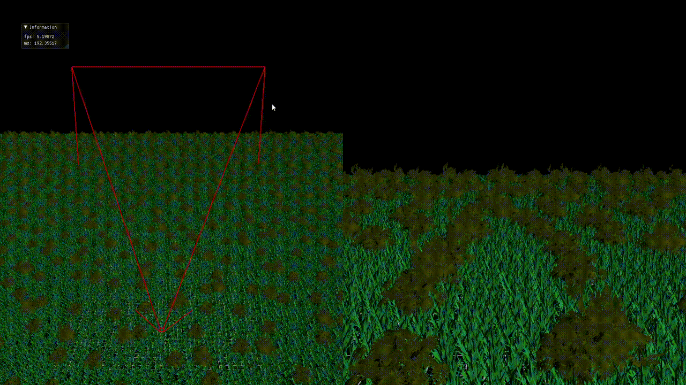
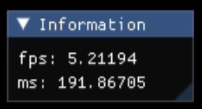
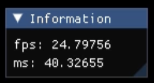

# Compute Shader Implementation
## Introduction
More than 100k grass instances would be rendered in the scene originally. Given a view frustrum, this project implements a compute shader culling the instances outside the frustrum, which **increases the fps by nearly 5-folds.**
## Showcase
Run on AMD Radeon™ Graphics
### original rendering  

### optimized rendering  

## How to run
1. Attach this externals file at the following link to the topmost directory:
[Externals](https://drive.google.com/drive/u/0/folders/14tMLb6_S-KenlXBv9BiFwUuH4I98soto)
2. Open `Rendering_Framework.sln` using Visual Studio 2026.
3. Press F5 to build and execute the program.
## How to use
* Press W, A, S, D to move the camera position of the view frusturm to see how these grass instances are culled.